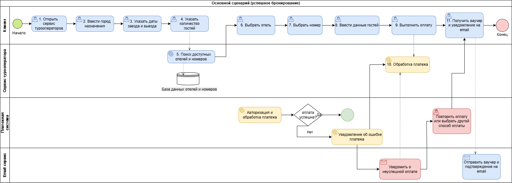

# Бизнес-функция: Бронирование отеля

## Описание

Функция «Бронирование отеля» предназначена для поиска и резервирования гостиничного номера пользователем через сервис туроператора. Пользователь может выбрать направление поездки, даты проживания, ознакомиться с доступными вариантами размещения и оформить бронирование с последующим подтверждением.

# Глоссарий

| Термин       | Определение                                       |
|--------------|---------------------------------------------------|
| Клиент       | Пользователь сервиса туроператора                 |
| Отель        | Средство размещения туристов                      |
| Номер        | Единица размещения в отеле                        |
| Бронирование | Резервирование номера на определенные даты        |
| Ваучер       | Документ, подтверждающий бронирование             |
| Оплата       | Процесс внесения денежных средств за бронирование |
| Туроператор  | Компания, предоставляющая туристические услуги    |

# Бизнес-цели

## Основная цель

Предоставить клиентам возможность самостоятельного онлайн-бронирования гостиниц без участия менеджера.

## Дополнительные цели

* увеличить количество онлайн-заказов;
* сократить время оформления бронирования;
* снизить нагрузку на сотрудников поддержки;
* повысить удовлетворенность клиентов;
* уменьшить количество ошибок при оформлении заказов.

# Описание бизнес-процесса

## Основной сценарий

1. Клиент открывает сервис туроператора.
2. Вводит город назначения.
3. Указывает даты заезда и выезда.
4. Указывает количество гостей.
5. Система отображает список доступных отелей.
6. Клиент выбирает отель.
7. Клиент выбирает номер.
8. Клиент вводит данные гостей.
9. Клиент выполняет оплату.
10. Система подтверждает бронирование.
11. Клиент получает ваучер и уведомление на электронную почту.

## Альтернативный сценарий

1. Во время оплаты возникает ошибка.
2. Система уведомляет пользователя о невозможности завершить платеж.
3. Пользователь повторяет оплату или выбирает другой способ оплаты.

# User Story

**Как клиент сервиса туроператора, я хочу забронировать номер в отеле на нужные даты, чтобы заранее обеспечить себе место проживания во время поездки.**

### Acceptance Criteria

**Сценарий 1**

**Дано:** пользователь выбрал город и даты проживания.

**Когда:** пользователь нажимает кнопку «Найти».

**Тогда:** отображается список доступных отелей.

**Сценарий 2**

**Дано:** пользователь выбрал номер.

**Когда:** пользователь успешно оплатил бронирование.

**Тогда:**

* создается запись о бронировании;
* пользователю отправляется подтверждение;
* формируется ваучер.

# Ограничения

## Бизнес-ограничения

* бронирование возможно только при наличии свободных номеров;
* стоимость проживания определяется поставщиком гостиничных услуг;
* отмена бронирования осуществляется согласно правилам отеля.

## Технические ограничения

* требуется доступ к сети Интернет;
* для завершения бронирования необходимо указать контактные данные;
* оплата осуществляется через поддерживаемую платежную систему.

# Definition of Ready (DoR)

Функционал считается готовым к разработке, если:

* определена бизнес-потребность;
* сформулирована User Story;
* согласованы бизнес-требования;
* определены ограничения;
* описан бизнес-процесс;
* подготовлены критерии приемки.

# Definition of Done (DoD)

Функционал считается реализованным, если:

* реализован поиск отелей;
* реализован выбор номера;
* реализовано создание бронирования;
* реализована оплата бронирования;
* реализована отправка подтверждения пользователю;
* проведено тестирование;
* отсутствуют критические дефекты;
* функционал принят заказчиком.

# Бизнес-функция «Бронирование отеля»

## BPMN-диаграмма

Ниже представлена BPMN-диаграмма бизнес-процесса «Бронирование отеля», отражающая основной сценарий оформления бронирования, а также альтернативный сценарий при возникновении ошибки оплаты.

    

*Рисунок 1 – BPMN-диаграмма бизнес-процесса «Бронирование отеля».*

---

## Участники бизнес-процесса

В процессе участвуют четыре основных участника.

| Участник | Описание |
|----------|----------|
| Клиент | Пользователь сервиса туроператора, выполняющий поиск отеля, выбор номера, ввод данных гостей и оплату бронирования. |
| Сервис туроператора | Информационная система, осуществляющая поиск гостиниц, обработку запросов пользователя, взаимодействие с базой данных и оформление бронирования. |
| Платежная система | Внешняя система, выполняющая авторизацию и обработку платежа, а также возвращающая результат выполнения операции. |
| Email-сервис | Сервис, предназначенный для отправки пользователю подтверждения бронирования и электронного ваучера. |

---

# Пояснение к диаграмме

## 1. Начало бизнес-процесса

Бизнес-процесс начинается с открытия пользователем сервиса туроператора. Клиент переходит к поиску подходящего варианта размещения.

---

## 2. Поиск гостиницы

На данном этапе пользователь последовательно выполняет следующие действия:

- вводит город назначения;
- указывает дату заезда;
- указывает дату выезда;
- задает количество гостей.

После получения параметров поиска сервис туроператора обращается к базе данных гостиниц и номеров для поиска доступных вариантов размещения.

Результатом данного этапа является формирование списка гостиниц, соответствующих введенным критериям поиска.

---

## 3. Выбор гостиницы

После получения результатов поиска клиент:

- выбирает подходящий отель;
- выбирает доступный номер;
- вводит данные гостей, необходимые для оформления бронирования.

После завершения ввода данных пользователь инициирует процесс оплаты.

---

## 4. Обработка платежа

После нажатия кнопки оплаты запрос передается в платежную систему.

Платежная система выполняет:

- авторизацию платежа;
- проверку корректности платежных данных;
- проверку возможности проведения платежной операции;
- обработку платежа.

По завершении обработки производится проверка результата выполнения операции.

---

## 5. Основной сценарий

Если платеж выполнен успешно, процесс продолжается следующим образом:

1. Сервис туроператора получает подтверждение успешной оплаты.
2. Выполняется обработка информации о платеже.
3. Формируется подтверждение бронирования.
4. Email-сервис отправляет пользователю электронный ваучер и подтверждение бронирования.
5. Пользователь получает уведомление на адрес электронной почты.
6. Бизнес-процесс завершается успешным окончанием.

---

## 6. Альтернативный сценарий

Если во время выполнения платежной операции возникает ошибка:

1. Платежная система фиксирует неуспешное выполнение операции.
2. Сервис туроператора получает информацию об ошибке.
3. Пользователь уведомляется о невозможности завершения оплаты.
4. Пользователю предлагается повторить оплату либо выбрать другой способ оплаты.
5. После успешного повторного выполнения платежа процесс продолжается по основному сценарию.

---

## Итог

Разработанная BPMN-диаграмма позволяет наглядно представить последовательность выполнения бизнес-процесса бронирования гостиницы, определить зоны ответственности каждого участника процесса, отразить взаимодействие между сервисом туроператора, платежной системой и Email-сервисом, а также продемонстрировать обработку как успешного, так и альтернативного сценариев выполнения бизнес-функции.
